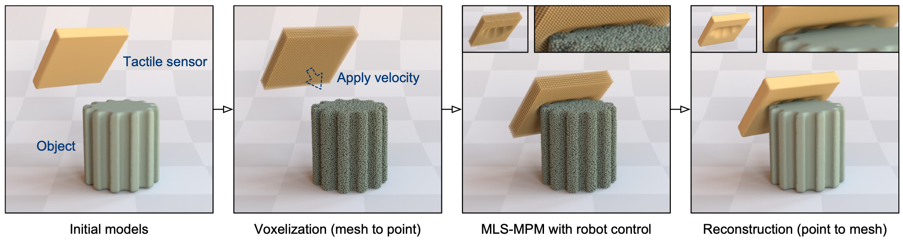
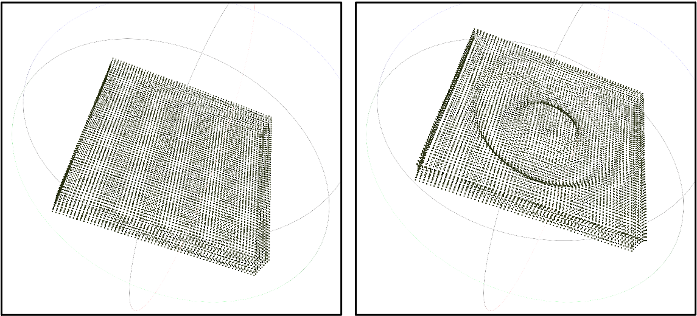
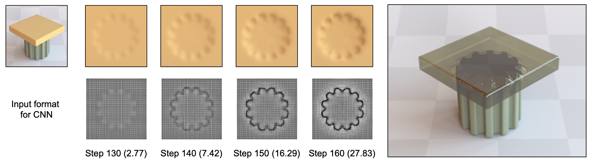

# EIP: Elastic Interaction of Particles
Code release for [**"Elastic Tactile Simulation Towards Tactile-Visual Perception"**](https://arxiv.org/pdf/2108.05013.pdf), in ACMMM (Oral) 2021.

By Yikai Wang, Wenbing Huang, Bin Fang, Fuchun Sun, Chang Li.

<p align="center"></p>


If you find our work useful for your research, please consider citing the following paper.
```
@inproceedings{wang2021eip,
  title={Elastic Tactile Simulation Towards Tactile-Visual Perception},
  author={Wang, Yikai and Huang, Wenbing and Fang, Bin and Sun, Fuchun and Li, Chang},
  booktitle={ACM International Conference on Multimedia (ACM MM)},
  year={2021}
}
```


## Dependencies
```
python==3.7.6
taichi==0.6.32
pytorch==1.6.0
pytorch3d==0.2.5
imageio==2.9.0
open3d==0.11.0
opencv-python==4.4.0
openexr==2.4.1
```

## Scripts

We provide two objects (torus and gear) as examples.

First, transform mesh to voxels
```
python mesh2voxel.py --path obj_path  # e.g., obj/torus.obj
```
Then perform EIP, for example,
```
python show_torus_vertical.py --name exp_name
```

Will obtain fine-grained tacile patterns like,

<p align="center"></p>

Simulated particles of the tactile sensor will be automatically saved, which can be visualized with [Meshlab](https://www.meshlab.net/),

<p align="center"></p>

Particles can be reconstructed to meshes by Meshlab (e.g., Surface Reconstruction). We adopt [Mitsuba](http://www.mitsuba-renderer.org/) for rendering.

Similarly, performing the vertical contact on the gear object (`show_gear_vertical.py`) provides the following deformation (after rendering),

<p align="center"></p>

We thank a lot for the flexible codebase of [Taichi](https://github.com/taichi-dev/taichi).

## License

EIP is released under MIT License.
